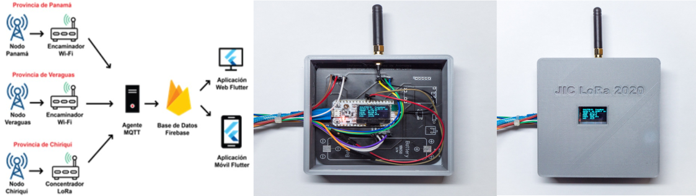

# LoRa-Avicultura

Design and implementation of a poultry farm monitoring system capable of obtaining and uploading parameters intrinsic to the farm’s sheds to an online database in real time, through the utilization of the LoRa wireless communication protocol.

* [Technological University of Panama](https://www.utp.ac.pa/)
* [Faculty of Electrical Engineering](http://www.fie.utp.ac.pa/)
* Bachelor of Science in Electronic and Telecommunications Engineering
* Supervising Professor: Fernando Merchán, PhD
## Table of contents
* [Project Members](#project-members)
* [Requeriments](#requeriments)
* [Resources](#resources)
* [How to use](#how-to-use)
## Project Members:
* Wvaldo Graell
* Ariel Guerra
* Gabriel Marzullo
* Fátima Batista
## Requeriments:
* LoRA WAN
* Firebase
* Flutter 
## Resources:
##### 
##### Topology & Prototype

##### Tests

